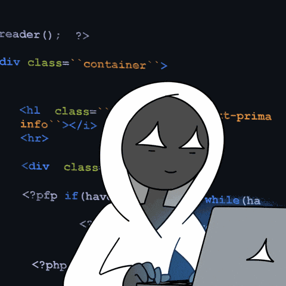

<!-- ===== Professional Developer Intro ===== -->

<div align="center">
  <div>
    
  </div>
  <div>
    <a href="https://git.io/typing-svg">
      
    </a>
  </div>


<br/><br/>



</div>

<!-- ===== End Intro ===== -->

<br/>

<p align="center">
  <a href="https://github.com/mahamudul-hasan7">
    
  </a>
  &nbsp;
  <a href="mahamud.xyz">
    
  </a>
</p>

## 🧑‍💻 About Me

```javascript
const mahamudul = {
    name: "Mahamudul Hasan",
    location: "Bangladesh 🇧🇩",

    currentFocus: [
        "Software Development",
        "Web Development",
        "Creative UI & Design"
    ],

    exploring: [
        "Cybersecurity",
        "Ethical Hacking",
        "Game Development",
        "Game & UI Design"
    ],

    mindset: "Learn → Build → Break → Understand → Improve",
    goal: "Become a versatile engineer who can build secure and meaningful technology."
};
```

I'm a curious developer who loves turning ideas into real digital products.

My journey is not limited to one field. I want to understand **how software is built, how systems work, how they can be secured, and how technology can create immersive experiences.**

> **Build creatively. Think logically. Secure responsibly. Keep learning.**

---

## 🎯 What I'm Focused On

|          💻 Software         |             🌐 Web             |             🛡️ Security            |           🎮 Game Dev          |             🎨 Design            |
| :--------------------------: | :----------------------------: | :---------------------------------: | :----------------------------: | :------------------------------: |
| Building useful applications | Modern interactive experiences | Learning cybersecurity fundamentals |   Exploring game development   | Creating better user experiences |
|        Problem solving       |       Frontend + Backend       |       Ethical hacking mindset       | Gameplay & interactive systems |        UI / visual design        |

---

## ⚡ Tech Stack

### Technologies I've Worked With

<div align="center">

[](https://skillicons.dev)

</div>

My current projects involve technologies such as **HTML, CSS, JavaScript, PHP**, along with experience exploring **Next.js, Tailwind CSS and modern frontend development**.

---

## 🚀 My Learning Roadmap

<div align="center">

### 🛡️ Cybersecurity & Ethical Hacking

[](https://skillicons.dev)

**Networking • Linux • Python • Web Security • Ethical Hacking • Secure Development**

<br/>

### 🎮 Game Development

[](https://skillicons.dev)

**Game Logic • C# • Unity • Godot • Unreal Engine • Interactive Systems**

<br/>

### 🎨 Creative Design

[](https://skillicons.dev)

**UI/UX • Game Design • 3D Exploration • Visual Experiences**

</div>

> These are technologies and areas I'm actively interested in learning and growing into — not a claim of mastery.


## 🐍 Contribution Snake

<div align="center">

<picture>
  <source
    media="(prefers-color-scheme: dark)"
    srcset="https://raw.githubusercontent.com/mahamudul-hasan7/mahamudul-hasan7/output/github-contribution-grid-snake-dark.svg"
  />
  <source
    media="(prefers-color-scheme: light)"
    srcset="https://raw.githubusercontent.com/mahamudul-hasan7/mahamudul-hasan7/output/github-contribution-grid-snake.svg"
  />
  
</picture>

</div>


### 💬 Build • Learn • Experiment • Improve

**Thanks for visiting my profile!**

<br/>

<a href="https://github.com/mahamudul-hasan7">
  
</a>

<br/><br/>

*"The goal isn't to know everything — it's to never stop learning."*

</div>


